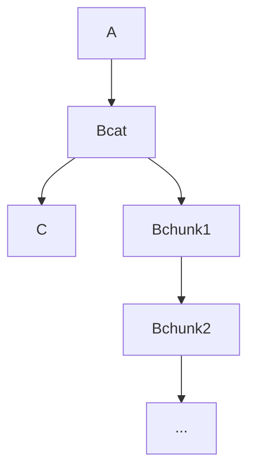

# Thredz concepts
* The most important concept in Threz is that Thredz is Layer 2 state and computation.
* Thredz persists state and execution in a metanet graph structure.
* Thredz strives to allow for a provider model. Schema, storage format, computation model ought to be swappable or pluggable.

## Thredz computation model
### State and threads of execution.
In a stack-based threaded compuation language, the current state of the application can be the current values of the stack.
State can be expressed through script, placed on a blockchain and then mutated by extending the thread of execution.  
Layer 2 script can loop.

Following the priciple of plug in architecture, other programming languages can be supported.

## Versioning
Thredz leverages the versioning of nodes that metanet allows.

## Logical handling of graph nodes
At times, we wish to handle a group of nodes as a single logical unit. This is encapsulation.
Splitting a file into chunks with bcat is such a case. Other use cases exist. 

Here, the Bcat node is the single facade presented to the rest of the graph. Nodes A and C need not be concerned with Node B chunks.
